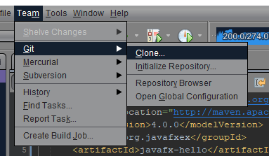
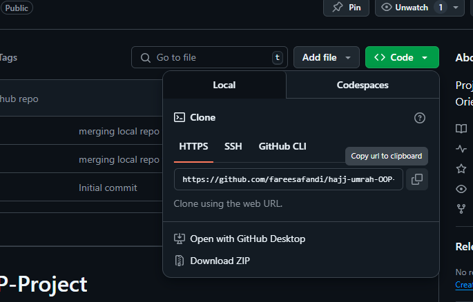

# Brief Guide to Using Git

### Step 1: Clone repository

Using git bash: 

Proceed to any directory suitable for this project
```bash
git clone <link of this github repository>

git clone https://github.com/fareesafandi/hajj-umrah-OOP-Project.git
```

Using Netbeans Git:



Go to the _Team_ column above and choose clone to copy this repository.



Copy the repository link


Insert github account credential (red box) and preffered directory for the project (yellow box). 


Choose any related branch to work on with (can be change later). 


Finalized repo cloning detail, keep remote name as 'origin'.

### Step 2: Create new branch

To commit changes into main branch, it is better to create a new branch in order to prevent 
error when making changes to main codebase.
Using git bash: 

**Creating a new branch**
```bash 
git branch <name-of-your-new-branch>
```

**Check the status of your branch**

Make sure you are in the right branch before commiting any changes 

```bash
git status 
* main 
  new-doc 
```  
the asterisk(*) indicate the branch you are currently in

**Changing branch** 
```bash
git checkout <another-branch>
```
Or
```bash
git switch <another-branch> 
```
This will be helpful in navigating between branch to track and manage changes.

### Creating a pull request

After the changes has been made to another branch and no error is detected then you can safely merge your
branch with the main branch 


